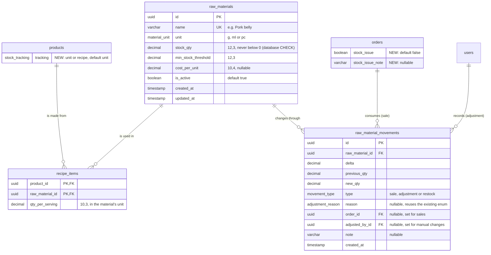

# Design: Stock per Raw Material (Objective 3)

Status: design approved in session 1 of 4 (2026-09-28). There are no code or schema changes yet.

## Goal

Objective 3 says the system "automatically deducts raw materials and stock units from the centralized database as soon as a transaction is completed" and "prevents both overstocking and unexpected shortages" (manuscript p. 6 [PDF 9]). Today the code deducts whole products only. This design adds raw-material deduction and keeps the manuscript's promise of accurate stock counts with no overselling (p. 29 [PDF 32], p. 34 [PDF 37]).

## 1. Two ways to track a product

| Tracking | Used for | Stock is deducted from |
|---|---|---|
| `unit` (current behaviour, the default) | Items sold as they are bought: bottled or canned drinks, ready items | The product's own count in `inventory` |
| `recipe` (new) | Cooked dishes: sisig, bulalo, rice | Each raw material in the recipe, by its amount per serving |

**Why:** Objective 3 names both "raw materials and stock units". Converting items that are bought and sold as they are into recipes adds work and no accuracy.

Every product has an explicit `tracking` value. The system does not decide based on whether a recipe exists, because a half-configured recipe would then silently deduct nothing.

## 2. Data model

**Design choices:**

- **Base units only (grams, millilitres, pieces).** Nothing is converted inside the database. The admin screens may display 2,500 g as "2.5 kg".
- **Decimal quantities**, because recipe amounts such as 85.5 g are normal.
- **`recipe_items` is a join table carrying a quantity**, keyed on (product, raw material), so the same material cannot appear twice in one recipe.
- **One movement ledger** records every raw-material change: sales, adjustments and restocks. Reports read the ledger, so past usage stays correct even after a recipe is edited.
- **The database itself rejects negative stock.** A migration adds a `CHECK (stock_qty >= 0)` rule to `raw_materials`, and the same rule should be added to `inventory`. Stock can never go below zero, even if the application code has a bug.
- **Unchanged:** `products.ingredients` stays as the customer-facing ingredient list on the kiosk; recipes hold the internal quantities. Unit-tracked products keep using `inventory` and `stock_adjustments`.

## 3. Rules

### 3.1 Placing an order (kiosk)
- **Unit product:** refuse if stock is below the quantity ordered. This is today's check.
- **Recipe product:** calculate the servings available (the smallest result, across its ingredients, of stock ÷ amount per serving). Refuse if that is below the quantity ordered.
- The check adds up needs across the whole order, so two dishes sharing an ingredient are checked together. Nothing is deducted at this stage.

### 3.2 Confirming a counter payment (staff): the stock guarantee
All of the following happens in **one database transaction**:
1. Add up everything the order needs: units for unit products, and each raw material for recipe products (qty × amount per serving).
2. Deduct each total with the existing atomic conditional update: decrement only when the stock is at least the amount needed.
3. **If anything is short, roll the whole transaction back.** Nothing is deducted, the payment is not marked paid, and staff see which item is short and how much can still be made, for example "Not enough Pork belly for 2 × Sizzling Sisig (enough for 1)".
4. If everything is available: record the "sale" movements, mark the payment paid, confirm the order, then create the kitchen tasks.

The staff workflow changes from "Confirm once the customer has paid" to **"Confirm, then collect payment"**, so a short order is caught before any money changes hands. The customer then changes the order at the counter.

### 3.3 Online payment (GCash or Maya through PayMongo)
PayMongo collects the money on its own hosted checkout page, so the rare short case cannot be blocked before the customer pays. When the payment confirmation from PayMongo (the webhook) arrives:
- Run the same transaction as in 3.2.
- **If stock is short:** deduct nothing and never go negative. Mark the payment paid (money was received), set `orders.stock_issue = true` with a note naming the missing item, and do not create kitchen tasks. The order appears on the staff screen as **"Stock issue: staff action needed"**, so staff can offer a substitute or refund.
- Once staff resolve it (edit the order, then confirm), the normal deduction runs.

### 3.4 Availability on the kiosk
- A recipe product is available only when at least one serving can be made. A unit product is available when its stock is above 0 (unchanged).
- When a raw material's stock changes, recalculate every product that uses it and send the existing `inventory:updated` live event for each one, so the kiosk shows "Sold out" immediately.

### 3.5 Low stock
Each raw material has its own minimum level. Raw materials at or below it appear in the dashboard banner, the low-stock list and the hourly worker check, alongside unit products.

### 3.6 Adjustments
Staff record restocks, spoilage, damaged goods and manual corrections against raw materials, with a reason, in `raw_material_movements`. Corrections cover the gap between the recipe and real portions, such as the kitchen using 90 g where the recipe says 85 g. This matches the manuscript's Stock Adjustments scope: "address inventory variances caused by … manual corrections" (p. 10 [PDF 13]).

## 4. Existing bug fixed by this design

`deductStockForOrder` (`apps/api/src/modules/inventory/service.ts:74`) runs after the payment is already marked paid, and it deducts one item at a time without a transaction. If a later item is short:
- earlier items stay deducted
- the function throws
- kitchen tasks are never created for a paid order

The one-transaction flow in 3.2 replaces it for both unit and recipe products.

## 5. Panel questions

- **What if two customers order the last sisig?** Availability is checked when the order is placed. When payment is confirmed, stock is checked again and deducted in one database transaction. Whoever is confirmed second is told it is sold out before paying, and a database rule keeps stock from ever going below zero.
- **Why not reserve stock when the order is placed?** Abandoned unpaid orders would hold ingredients indefinitely, so reservation first needs order expiry, which is not built. Checking at confirmation gives the same guarantee with less risk. Reservation is future work.
- **Why keep unit tracking at all?** Objective 3 names both "raw materials and stock units", and items bought and sold as they are (such as bottled drinks) gain nothing from a recipe.
- **What if the real portion differs from the recipe?** Staff correct it through a stock adjustment with a reason, and every change is recorded in the movement ledger.

## 6. Open items

- **Real recipes from the client:** grams or pieces per serving for Zak's main dishes. Development uses realistic sample recipes; the defense should use Zak's own recipes.
- **Which products use `recipe` tracking** (proposed: sizzling plates, soups, rice dishes) **and which stay `unit`** (bottled or canned drinks).

## 7. Remaining sessions

| Session | Work |
|---|---|
| 2/4 | Migration (new tables, enums, `tracking`, `stock_issue`, CHECK rules) and seed data; the one-transaction confirmation (3.2 and 3.3); the order-placement check (3.1); availability recalculation (3.4) |
| 3/4 | Admin screens: a Raw Materials page (list, adjust, restock, low stock), a recipe editor in the product form, the staff "stock issue" state, and the "Confirm, then collect payment" wording |
| 4/4 | Dashboard, low-stock list, reports and worker check; end-to-end verification; manuscript updates (Objective 3 wording check, ERD, data dictionary, Stock Adjustments text) |
